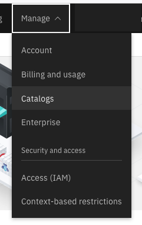
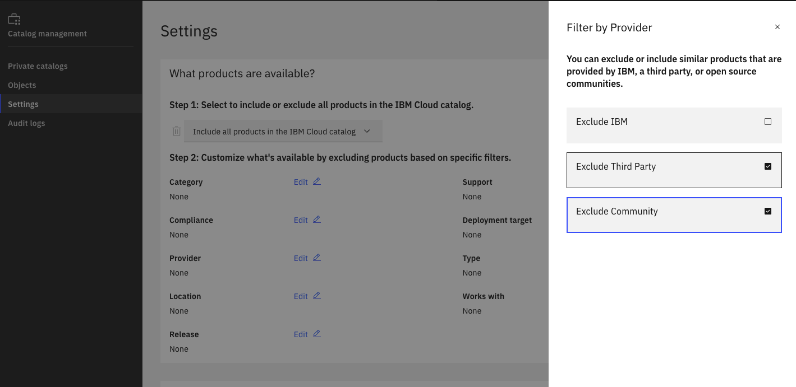

# 00-account-setup

## Dependencies

This terraform has no dependencies and can be run on any account.  

## What it Creates

This terraform does the following

1. Sets account policies for MFA, whether to restrict service id and apikey creation and an IP allowlist for the account.
1. Creates a Resource Group for account resources
1. Creates Cloud Object Storage in the Resource Group. This can be used for Security and Compliance Center reports and Flow Logs as well as other use cases as needed.
1. Creates an instance of Key Protect in the Resource Group.  Keys can be created here to encrypt Cloud Object Storage buckets and any other data that supports KMS integration.
1. Creates an instance of Activity Tracker in the Resource Group with a 7 day retention period.  It routes events from other regions to this instance of Activity Tracker so that global and local events are available.
1. Create several standardized Access Groups which can be assigned to users in your Cloud Account.  The Access Groups are based on the documenation here: https://cloud.ibm.com/docs/framework-financial-services?topic=framework-financial-services-shared-account-access-management

The Access Groups and the Roles that they are assigned are a starting point and should be reviewed for your team requirements and customized as needed.

| Access Group | Description |
|--------------|-------------|
| cloud-organization-admins | Responsible for organizing the structure of the resources used by the organization. |
| cloud-network-admins | Responsible for creating networks, VPCs, load balancers, subnets, firewall rules, and network devices. |
| cloud-security-admins | Responsible for establishing and managing security policies for the entire organization, including access management and organization constraint policies. |
| cloud-billing-admins | Responsible for setting up billing accounts and monitoring their usage. |
| cloud-devops | DevOps practitioners create or manage end-to-end pipelines that support continuous integration and delivery, monitoring, and system provisioning. | 
| cloud-developers | Developers are responsible for designing, coding, and testing applications. |

The terraform populates these Access Groups with Roles/permissions.  Roles for IBM Identity and Access Management (IAM) enabled services can be found here https://cloud.ibm.com/docs/account?topic=account-iam-service-roles-actions.  See below for the Roles assigned by this terraform to each Access Group.

### Cloud Organization Administrator

| Scope | Platform Role | Service Role | Notes |
| ------|---------------|--------------|-------|
| All Identity and Access enabled services  | Administrator | N/A | |
| All IAM Account Management services | Administrator | Service ID and API Key Creator | The explicit roles for Service ID and API Key creation are needed if these are restricted in Account Settings  | 
| All Account Management services | Administrator | N/A | | 
| Support Center | Editor | N/A | |
| Cloud Object Storage | Manager | None | Required for creation of Cloud Object Storage buckets |

### Network Administrator

| Scope | Platform Role | Service Role | Notes |
| ------|---------------|--------------|-------|
| VPC Infrastructure Services (is) | Administrator | IP Spoofing Operator | Depending on the solution and connectivity requirements, you may need additional Service roles assigned to this Access Group |
| All Identity and Access enabled services | Editor | N/A | |
| Support Center | Viewer | N/A | |

### Cloud Security Administrator

| Scope | Platform Role | Service Role | Notes |
| ------|---------------|--------------|-------|
| IAM Access Groups Service | Administrator | N/A | |
| All Account Management services | Administrator | N/A | |
| All Identity and Access enabled services | Viewer | N/A | |
| All IAM Account Management services |  Administrator | Service ID and API Key Creator | The explicit roles for Service ID and API Key creation are needed if these are restricted in Account Settings  | 
| Security and Compliance Center | Administrator | None | |
| IBM Cloud Activity Tracker | Administrator | Manager | |
| Kubernetes Service | Viewer | Reader | |

### Cloud Billing Administrator

| Scope | Platform Role | Service Role | Notes |
| ------|---------------|--------------|-------|
| Billing | Administrator | N/A | |
| Support Center | Editor | N/A | |

### Cloud DevOps 

| Scope | Platform Role | Service Role | Notes |
| ------|---------------|--------------|-------|
| Kubernetes Service | Administrator | Manager | |
| IBM Cloud Activity Tracker | Editor | Manager | |
| Support Center | Editor | N/A | |
| Cloud Object Storage | None | Manager | |
| All Identity and Access enabled services | Viewer | N/A | |
| VPC Infrastructure Services | Viewer | Operator | | 
| Continuous Delivery | Editor | Manager | |
| Toolchain | Administrator | N/A | |
| Schematics | Administrator | Manager | |

## Cloud Developer 

| Scope | Platform Role | Service Role | Notes |
| ------|---------------|--------------|-------|
| Kubernetes Service | Administrator | Manager | |
| Support Center | Editor | N/A | |

## To Run

Copy `terraform.tfvars.template` to `terraform.tfvars` and provide your **ibmcloud_api_key**.  Review the **Input** section below and fill in any required variables or any that you wish to override.

Run the terraform using:

1. `terraform init` to initialize the Terraform working directory
1. `terraform plan` to view the resources that will be created
1. `terraform apply` to run the terraform template.  This command will show you the same output as `terraform plan` and give you an opportunity to abort before it executes.

## Input

| Name | Description | Type | Default/Example | Required |
| ---- | ----------- | ---- | ------- | -------- |
| ibmcloud_api_key | API Key created in pre-requisites | string | N/A | yes |
| region | Region where resources will be provisions | string | Default: "ca-tor" | If you override the default, you may need to override activity_tracker_route_sources as well |
| mfa | MFA account setting.  Options can be found [here](https://registry.terraform.io/providers/IBM-Cloud/ibm/latest/docs/resources/iam_account_settings). | string | Default: "LEVEL1".  This specifies email for all users. | Override or use default. |
| restrict_serviceids | This specifies whether Service ID creation is restricted and therefore managed via IAM | string | Default: "RESTRICTED".  Other options are "NOT_RESTRICTED" and "NOT_SET" | Override or use default. |
| restrict_apikeys | This specifies whether API Key creation is restricted and therefore managed via IAM | string | Default: "RESTRICTED".  Other options are "NOT_RESTRICTED" and "NOT_SET" | Override or use default. |
| allowed_ips | Comma-delimited list of IPs and/or IP ranges that allowed access to the account.  Be careful with this one.  Note that Cloud Shell will not be available if you use this feature (unless you specify "0.0.0.0/0") | string | Default: "0.0.0.0/0" | Stay with 0.0.0.0/0 which is effectively no restriction or supply your own IPs |
| resource_group_name | Name of resource group for services provisioned by this terraform | string | Default: "base-resource-group" | Override or use default. |
| prefix | Prefix to use as a naming convention for all resources | string | Default: "base" | Override or use default. |
| activity_tracker_route_sources | Regions that will forward events to your Activity Tracker instance | list(string) | Default: ["us-south", "us-east", "global"] | Override or use default. |
| activity_tracker_plan | Activity Tracker plan | string | Default: "7-day" | Override or use default. |

## Output

These outputs are used by other terraform templates in the parent folder.  Some of the inputs are propagated to ensure consistency and avoid the need to provide them again.

| Name | Description |
| ---- | ----------- |
| resource_group_name | Name of resource group specified as input |
| region | Region specified as input |
| cos_name | Name of Cloud of Object storage instance that was created |
| key_management_name | Name of Key Protect instance that was created |
| prefix | Prefix specifed as input |

## Next Steps

### Configure the IBM Cloud Marketplace to restrict access to 3rd party offerings.

* Log into your IBM Cloud account
* Navigate to Manage->Catalog at the top right

* Select Settings on the left to configure the Catalog settings
* In the "What products are available" section, in Step 1 Keep the default **Include all products in the IBM Catalog**
* In Step 2, select **Edit** beside **Provider**
* Exclude Third Party and Community products and select **Update**.  Now only IBM products will be visible in the Catalog.

### Setup Workload

Proceed to [30-workload](../20-workload/) to set up your workload infrastructure.