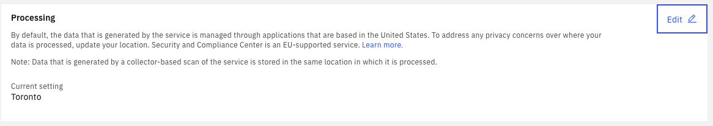
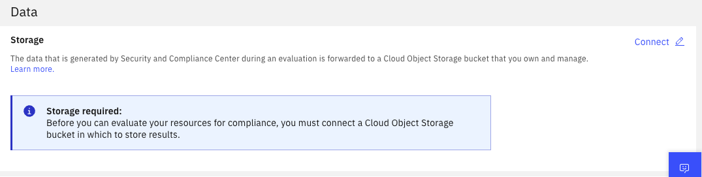
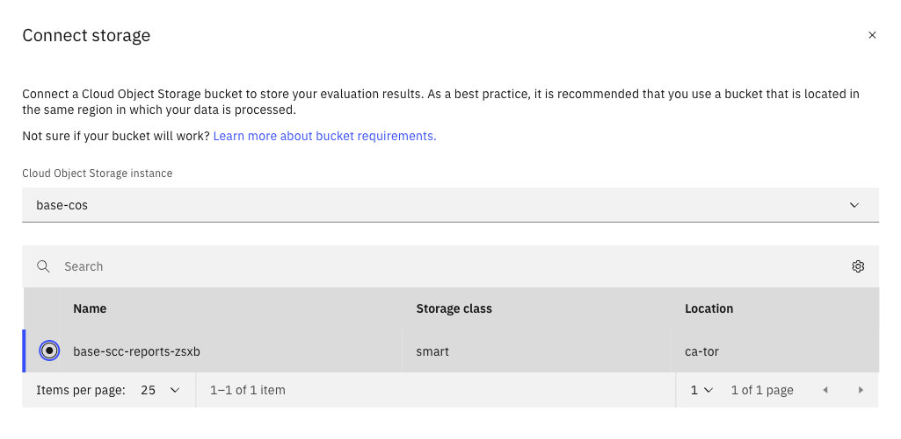
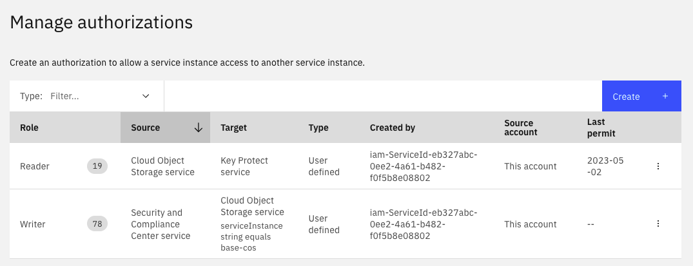

# 30-scc-setup

## Dependencies

This terraform depends on [00-account-setup](../00-account-setup/) and must be run within the folder structure as it will look for output from 00-account-setup.

## What it Creates

The terraform creates the following:

1. An encryption key in Key Protect that is used to encrypt Security and Compliance Center (SCC) reports stored in Cloud Object Storage
1. A Service-to-Service authorization to permit Cloud Object Storage (COS) to read keys from Key Protect
1. A COS bucket for storing SCC reports encrypted with the key from the previous step.
1. A Service-to-Service authorization to permit SCC to write to COS

Note: To configure a Control Library for GC Guardrails, please reach out by email to jared.killoran@ibm.com or behzadk@ca.ibm.com.

## To Run

Copy `terraform.tfvars.template` to `terraform.tfvars` and provide your **ibmcloud_api_key**. 

Run the terraform using:

1. `terraform init` to initialize the Terraform working directory
1. `terraform plan` to view the resources that will be created
1. `terraform apply` to run the terraform template.  This command will show you the same output as `terraform plan` and give you an opportunity to abort before it executes.

## Configure Security and Compliance Center

You must now configure Security and Compliance Center with the following steps:

### Upgrade Security and Compliance Plan if Needed

Navigate to the three bars at top left to open the menu and select `Security and Compliance->Settings`.  If prompted to upgrade your plan, follow the links to complete this step.

### Set Processing Location

By default Security and Compliance Center processes data in the US.  Change this setting to `Toronto` in the **Processing** section of the **Settings** page.  

**Note!!**:  Any existing scans, as well as any custom Rules, Control Libraries and Profiles will be deleted when you switch regions.  Proceed with caution if you have been using SCC in a different processing region.  Currently, an account can only have a single instance of SCC.

### Set Data Store for Reports

Security and Compliance Center will store reports in your Cloud Object Storage bucket to give you control over where this data is stored and what policies you want to apply.

The Cloud Object Storage bucket created by the terraform has the following configuration:

* Located in the Toronto region 
* Encrypted with a Key stored in Key Protect
* It has a 7 day expiration rule.  If you need a longer expiration policy or no expiration, the terraform can be modified.

Return to `Security and Compliance->Settings` to connect to your COS bucket.  You should see a `Connect` button as in the following image.

When you select `Connect` you will be prompted to select your Cloud Object Storage instance and bucket.  If you use the terraform parameter defaults, you will see the following image.

**Troubleshooting**: If Security and Compliance Center cannot find any Cloud Object Storage instance, then there may be an issue with the service-to-service authorization.  You should see the following two service-to-service authorizations in `Manage->IAM->Authorizations`.  The first authorizes Cloud Object Storage to read Key Protect keys and the second authorizes SSecurity and Compliance Center to write to Cloud Object Storage.

### Next Steps

Follow instructions for uploading the `GC Profile 1` Security and Compliance Center Profile.

